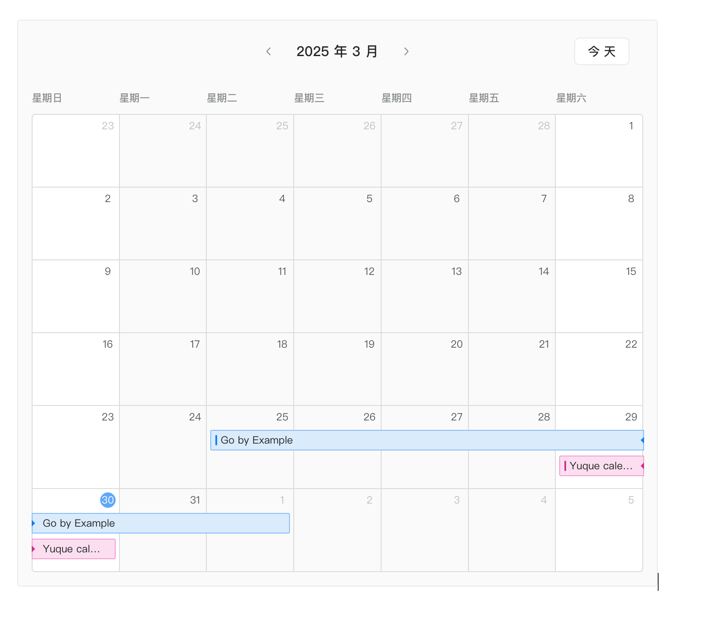

# Precise Calendar

一个基于 React 和 FullCalendar 的现代化日历应用，专注于精确的时间管理和任务追踪。特别适合需要记录断断续续工作时间的场景，让时间管理更加真实和可控。

- TypeScript
- Vite
- FullCalendar
- TailwindCSS
- Zustand
- React Hook Form
- Zod

**主要特性**

- 现代化的用户界面
- 响应式设计
- 多时间点任务管理
  - 支持为单个任务绑定多个时间点
  - 完美处理跨周末、断断续续的工作记录
  - 更精确的时间追踪和统计
- 事件拖拽和调整大小
- 数据本地存储
  - 使用 localStorage 持久化存储事件数据
  - 支持数据导出为 JSON 文件
  - 支持从 JSON 文件导入数据
  - 方便数据备份和跨设备迁移

## 缘起

最近在公司用了一段类似上图这样的整理，来记录自己的精力投入，方便回顾、规划和有掌控感

Yuque 这个日历能力做的我挺喜欢 克制 能力简洁高效

但我还想到一个优化点
很多事情可能是断断续续做的 没法连着记录
比如工作排期很容易遇到这样的情况，因为周末是不算工作时间的

So 从 Task 视角来看，Task 需要有绑定多个时间的能力

这样的记录时间是更加精确的
